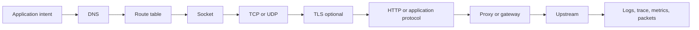
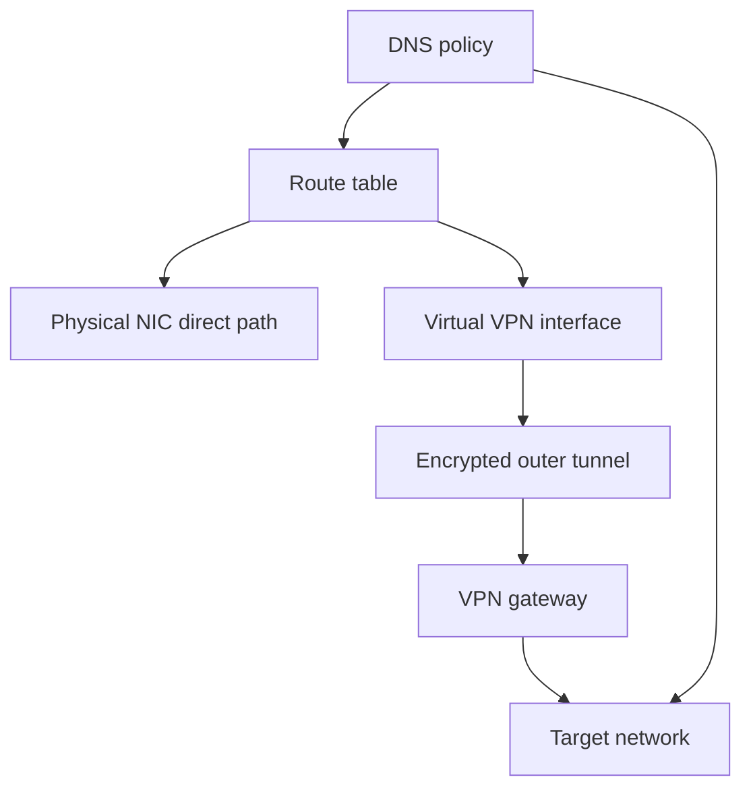
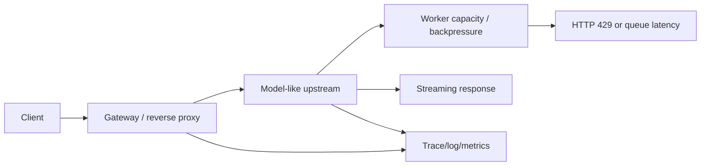

# Concept Map

These maps show how the labs connect. They are not new architecture; they are the same 10-week path with AI engineering and VPN branches made explicit.

## General Request Path

DNS decides names. The route table decides paths. TCP/UDP carries bytes or datagrams. TLS may hide HTTP content. HTTP/protocol code gives status, headers, body, and streaming behavior. Proxies and gateways add another downstream/upstream split.

## VPN Branch

VPN is not a single layer. It changes DNS policy and routing, which then changes what TCP, TLS, and HTTP experience. On a physical NIC capture you may see the encrypted outer tunnel, not the inner HTTP request.

## Model Serving Branch

Model serving network failures are often combined failures: gateway timeout, proxy buffering, slow first token, overloaded worker queue, Docker name/port mismatch, or VPN/DNS path issues.
